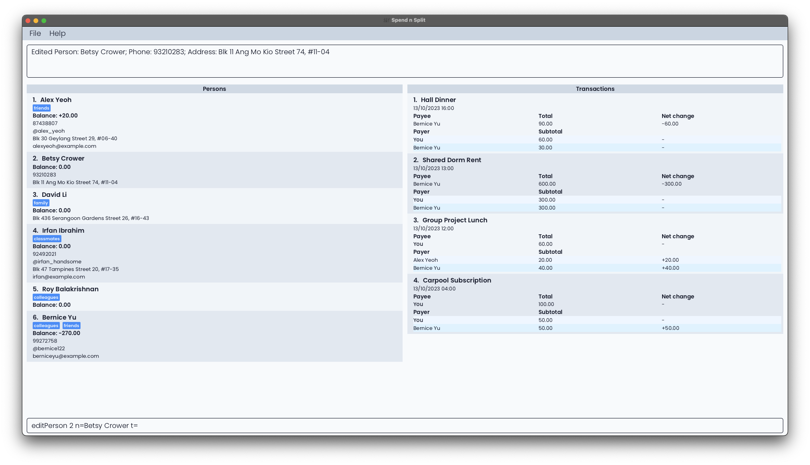
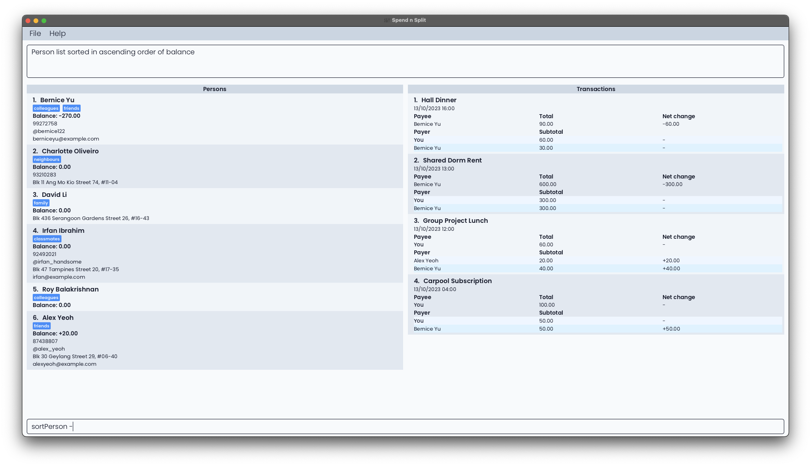
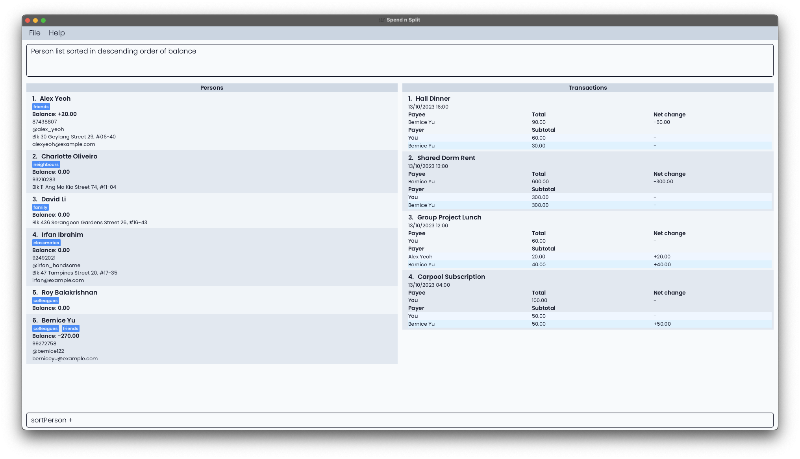
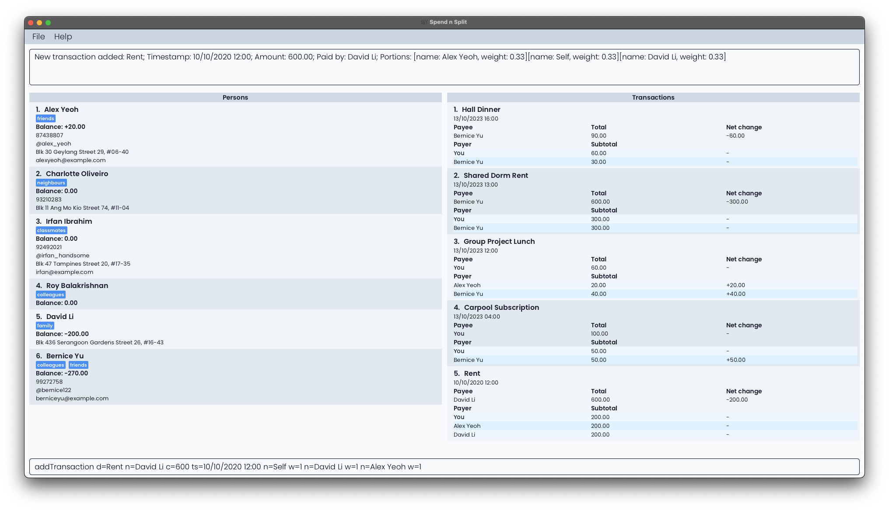
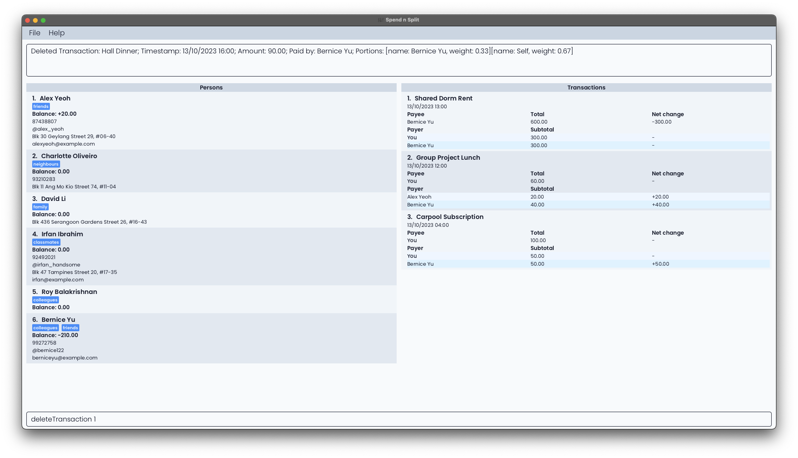
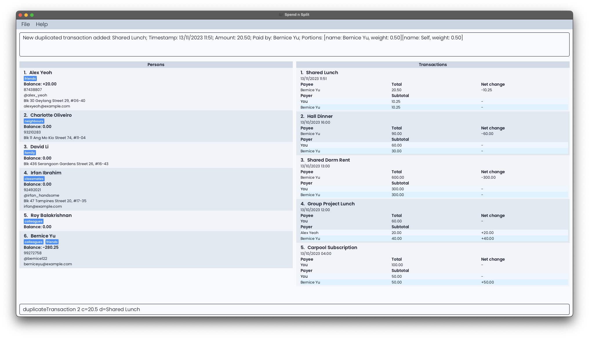
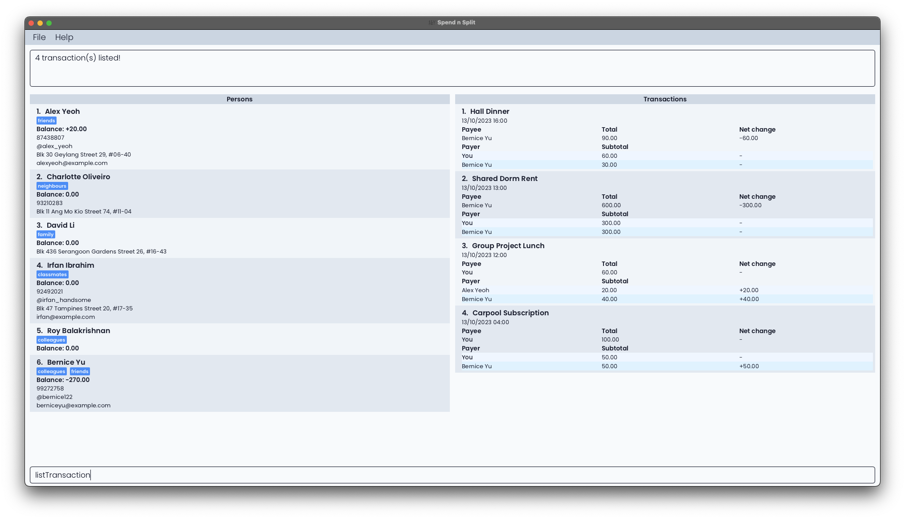
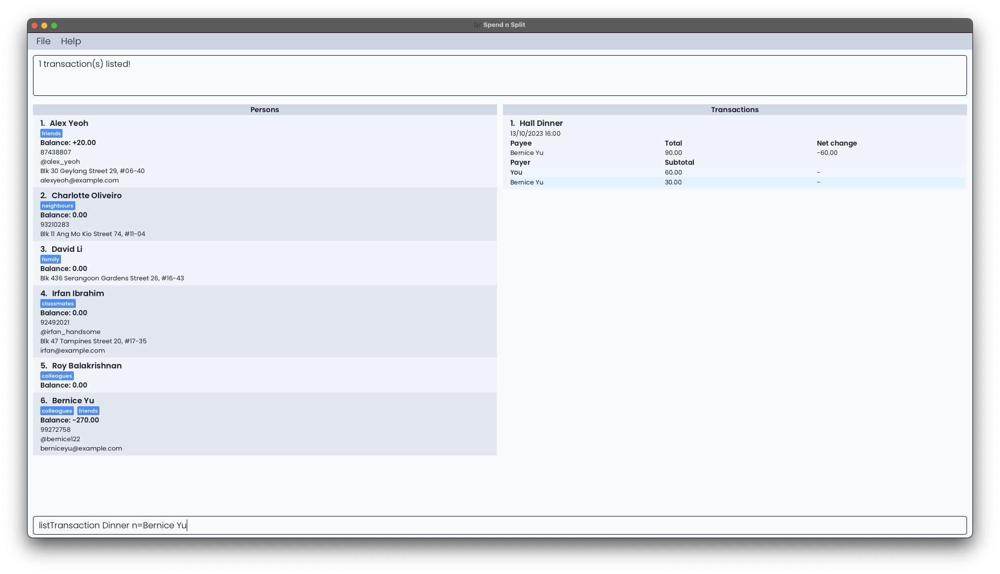
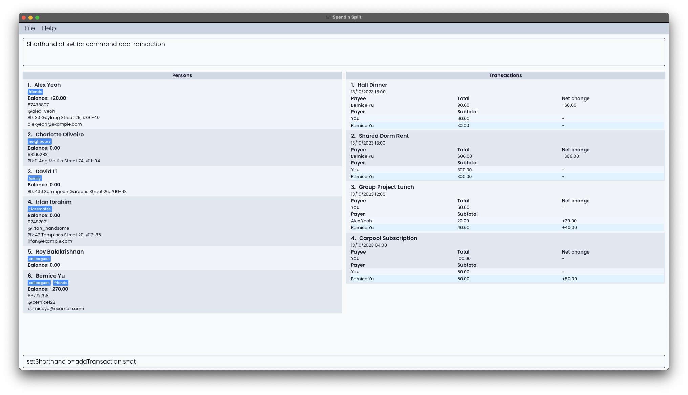
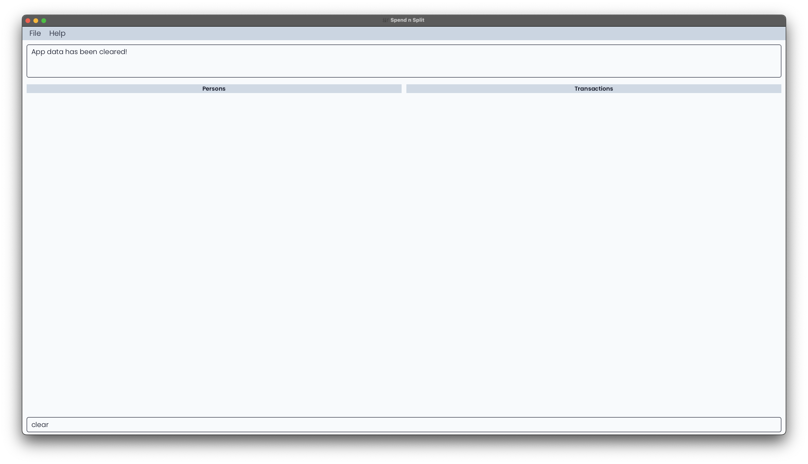

## Introduction
***Taking care of your finances has never been easier!***

Spend N Split (SNS) is an application meant for managing transactions from your contacts list. Built for university students that reside on campus, it utilises your fast typing skills to help you maintain financial accountability between yourself and your peers. All you need to do, is to record your transactions in Spend N Split. Filtering, sorting, as well as the calculations of balances owed will be automatically handled by Spend N Split.

Spend N Split is perfect for **you** if you are
1. A university student staying on campus.
2. A fast typist.
3. Comfortable using a keyboard to make full use of the application.

--------------------------------------------------------------------------------------------------------------------

## Table of Contents

1. [Introduction](#introduction)
2. [Table of Contents](#table-of-contents)
3. [How to use the User guide](#how-to-use-the-user-guide)
4. [Labels](#labels)
5. [Key Terms](#key-terms)
6. [Quick Start](#quick-start)
7. [Navigating the App](#navigating-the-app)
8. [Parameters](#parameters)
9. [Features](#features)
10. [Data](#data)
11. [FAQ](#faq)
12. [Acknowledgements](#acknowledgements)
13. [Glossary](#glossary)


--------------------------------------------------------------------------------------------------------------------
## How to use the User Guide

1. If Spend N Split is not yet installed, kindly navigate to the [Quick Start](#quick-start) section, which includes steps for installation
as well as sample commands for you to try.

2. If you are not yet familiar with Spend N Split and want a refresher, we highly recommend heading to the [Navigating the App](#navigating-the-app) section.

3. Already an experienced user? Well, head to the [Features](#features) section for a quick
refresher on what Spend N Split can do for you!

--------------------------------------------------------------------------------------------------------------------
## Labels

In our user guide, you may find coloured boxes that contain highlighted pieces of text.

<div markdown="block" class="alert alert-info">
:bulb: Cyan boxes represent helpful tips to enhance your experience.
</div>

<div markdown="block" class="alert alert-primary">
:warning: Blue boxes represent warnings that you should be cautious about.
</div>

<div markdown="span" class="alert alert-danger">
:heavy_exclamation_mark: Red boxes represent dangers that you should pay a lot of attention to.
</div>

--------------------------------------------------------------------------------------------------------------------

<div style="page-break-after: always;"></div>

## Key Terms

The Spend N Split application links transactions and people. As such, it is important that you familiarise yourself
with the structure of each person and each transaction in our application.

### Person

A person is someone that you track your balance against. Before creating a transaction involving a specific
person, that person has to exist in the application. If not, that person has to be added to the application before the transaction
is created.

A person has the following attributes:
- Name (Compulsory)
- Balance (Calculated by the application)
- Tag(s) (Optional)
- Phone number (Optional)
- Telegram handle (Optional)
- Email Address (Optional)
- Address (Optional)

Every person is identified by their name. Names are case-insensitive and the application does not support
adding people with the same names. This means that you cannot add two or more people with the same name.

<div markdown="block" class="alert alert-info">
:bulb: If a positive balance is displayed on a person, it means that they owe you money. Conversely, if the balance displayed is
negative, you owe that person money instead.
</div>

<div style="page-break-after: always;"></div>

### Transaction

Transactions are events in which money is exchanged.

A transaction has the following attributes:
- Description (Compulsory)
- Payee (Compulsory)
- Payer (Compulsory)
- Amount (Compulsory)
- Timestamp (Optional. If this is not provided, the application will use the current system time of the computer for the Timestamp)
- Portion(s)

<div markdown="block" class="alert alert-primary">
:warning: There are 2 special names when adding transactions - "Self" and "Others". "Self" refers to you (the user of this application) and "Others" refers to people that have not been added to the application.
</div>

After a transaction, each payer in the list of portions owes the payee a fraction of the amount, based on their weights in the list of portions.

--------------------------------------------------------------------------------------------------------------------

<div style="page-break-after: always;"></div>

## Quick Start

1. Ensure you have Java `11` or above installed in your computer.

    To check the version of Java installed on your computer, click [here](https://www.java.com/en/download/help/version_manual.html) if you are using a Windows or Mac computer, and click [here](https://phoenixnap.com/kb/check-java-version-linux)
   if your computer is running Linux.


2. Download the latest `spendnsplit.jar` from [here](https://github.com/AY2324S1-CS2103T-W17-3/tp/releases/tag/v1.4).

3. Copy the file to the folder you want to use as the _home folder_ for your Spend N Split.

4. Open a command terminal, `cd` into the folder you put the jar file in, and use the `java -jar spendnsplit.jar`
   command to run the application.<br>
   A GUI similar to the one shown below should appear in a few seconds. Note how the application contains some sample data.<br>
   

5. Type the command in the Command Input Field and press Enter to execute it. e.g. typing **`help`** and pressing Enter will
   open the help window.<br>
   Some example commands you can try:

    * `listPerson` : Lists all persons.

    * `listTransaction` : Lists all transactions.

    * `exit` : Exits the application.

6. Learn more about navigating the application in the [Navigating the App](#navigating-the-app) section below.
7. Learn more about the commands in the [Features](#features) section below.

--------------------------------------------------------------------------------------------------------------------

## Navigating the App

Spend N Split has an intuitive Graphical User Interface (GUI) that allows you to navigate the application easily.


| Component                  | Description                                                                                                                |
|----------------------------|----------------------------------------------------------------------------------------------------------------------------|
| **Command Input Field**    | Type commands here and press `Enter` to execute them.                                                                      |
| **Command Output Display** | Shows the result of the command execution.                                                                                 |
| **Transaction List**       | Shows a list of transactions. <br/> The list can be filtered and sorted by the user.                                       |
| **Transaction Card**       | Shows the details of a transaction. <br/> Details include the description, date, payee, as well as the breakdown of costs. |
| **Person List**            | Shows a list of persons. <br/> The list can be filtered and sorted by the user.                                            |
| **Person Card**            | Shows the details of a person. <br/> Details include name, balance, phone number, etc.                                     |

--------------------------------------------------------------------------------------------------------------------

## Parameters

Some of our commands require parameters, which have specific formats and constraints applied on them. Before heading to the [Features](#features) section, we recommend taking a look at the type of parameters required by commands.
<br>

<div markdown="span" class="alert alert-danger">
:heavy_exclamation_mark: All inputs to parameters should not contain the "=" sign.
</div>
The following parameters are used for commands:

| Parameter     | Prefix | Format                                                                                                                                                                                                         | Example |
|---------------| --- |----------------------------------------------------------------------------------------------------------------------------------------------------------------------------------------------------------------| --- |
| Index         | - | Positive integers only                                                                                                                                                                                         | `1`, `2`, `3` |
| Keyword       | - | Should not contain the "=" sign as mentioned above. No other restrictions                                                                                                                                      | `Bob`, `Lunch` |
| Name          | n | Alphanumeric, can contain multiple words                                                                                                                                                                       | `Bob`, `Alex Yeoh` |
| Phone number  | p | Numeric, minimum length of 3 digits                                                                                                                                                                            | `99999999`, `88888888` |
| Telegram handle | tg | Starts with @, followed by a minimum of 5 alphanumeric characters or underscores                                                                                                                               | `@nus_cs2103` , `@spend_n_split` |
| Email address | e | Valid email format only                                                                                                                                                                                        | `damithch@comp.nus.edu.sg`, `dcsdcr@nus.edu.sg` |
| Address       | a |  Should not contain the "=" sign as mentioned above. No other restrictions                                                                                                                                                                                                             | `Kent Ridge Hall`, `RC4` |
| Tag           | t | Single-word, alphanumeric                                                                                                                                                                                      | `friend`, `colleague` |
| Description   | d |  Should not contain the "=" sign as mentioned above. No other restrictions                                                                                                                                                                                                             | `Lunch`, `Dinner @ UTown` |
| Amount/ Cost  | c | Positive rational numbers either in decimal or fraction format. Spaces are allowed                                                                                                                             | `12`, `.5`, `0.5/3`, `1.25 / 1.56`, `12 000 000` |
| Timestamp     | ts | Dates should be formatted as DD/MM/YYYY, and time as HH:MM. You have the option to include only the date or time, or both. When providing both, ensure that the date precedes the time, with a space in between | `12:12`, `31/12/2020`, `28/02/2021 00:00` |
| Weight        | w | Positive rational numbers either in decimal or fraction format. Spaces are allowed                                                                                                                             | `12`, `.5`, `0.5/3`, `1.25 / 1.56`, `12 000 000` |
| Original command | o | An original command keyword listed in this user guide                                                                                                                                                          | `setShorthand`, `addTransaction` |
| Shorthand     | s | Single-word, English alphabet characters only                                                                                                                                                                  | `s`, `aT` |

Spend N Split checks the validity of Telegram handles and email addresses according to the formats defined in the table above. It will
reject all Telegram handles and email addresses that do not follow the format.

--------------------------------------------------------------------------------------------------------------------

<div style="page-break-after: always;"></div>

## Features

<div markdown="block" class="alert alert-primary">

:warning: Notes about the command format:<br>

- Words in `UPPER_CASE` are the parameters to be supplied by the user.<br>
  E.g. In `addPerson n=NAME`, `NAME` is a parameter to be provided by the user. <br>Example usage: `addPerson n=John Doe`.

- Items in square brackets are optional.<br>
  E.g. For `n=NAME [t=TAG]`: <br> Example usage `n=John Doe t=friend` or `n=John Doe`.

- Items followed by `…` are optional and can be listed multiple times.<br>
  E.g. For `[t=TAG]…​`: <br> Example usage: " " (0 tags), or `t=friend` (1 tag) or `t=friend t=family` (2 tags).

- If it is mentioned that the order of the parameters is flexible, it means that parameters can be in any order.<br>
  E.g. For `n=NAME p=PHONE` <br> Example usage: `n=Bob p=91722828` or `p=91722828 n=Bob` are both accepted and will be treated as equivalent inputs by the application.

- Unnecessary parameters provided for commands (such as `help`, `clear`, `exit`) that do not accept them will be disregarded. <br> E.g. for the command `help` which does not accept any parameters, entering the command `help 123` will be interpreted by the application as `help`.

- If you are using a PDF version of this document, be careful when copying and pasting commands. Space characters such as " " may result in errors. It is recommended that commands are manually copied and typed into the application.

</div>

### Person-related features

#### Adding a person: `addPerson`

Adds a person to the application.

Format: `addPerson n=NAME [p=PHONE] [tg=TELEGRAM_HANDLE] [e=EMAIL] [a=ADDRESS] [t=TAG]…​`

The command word (addPerson) has to be at the front of the command. The order of the remaining parameters is flexible.

After the command has been executed, every person in the application will be displayed in the Person List.

Examples:

* `addPerson n=John Doe p=98765432 e=johnd@example.com a=John street, block 123, #01-01`
* `addPerson n=Betsy Crowe t=friend e=betsycrowe@example.com a=London Block 55 p=1234567 t=London`

Note: Only the name is compulsory when adding a person. After a person has been added to the application, more attributes to that person can be added using the `editPerson` command.

Once an attribute has been added to a person, it can only be edited and cannot be deleted, except for the tags of a person (as elaborated below under [Editing a person](#editing-a-person--editperson)).


#### Editing a person : `editPerson`

Edits an existing person in the application.

Format: `editPerson INDEX [n=NAME] [p=PHONE] [tg=TELEGRAM_HANDLE] [e=EMAIL] [a=ADDRESS] [t=TAG]…​`

The command word (editPerson) and the index has to be at the front of the command. The order of the remaining parameters is flexible.

* Edits the person at the specified `INDEX`. The index refers to the index number shown in the displayed Person List.
  The index **must be a positive integer** 1, 2, 3, …​
* At least one of the optional parameters must be provided.
* Existing values will be updated to the input values.
* When editing tags, the existing tags of the person will be removed i.e. adding of tags is not cumulative.
* You can remove all the person’s tags by typing `t=` without
  specifying any tags after it. However, this will only work if there is a single tag parameter. `t=` will work, but `t=Friend t=` will result in an input error.

After the command has been executed, every person in the application will be displayed in the Person List.

Examples:

* `editPerson 1 p=91234567 e=johndoe@example.com`
    * Edits the phone number and email address of the 1st person to be `91234567` and `johndoe@example.com`
      respectively.
* `editPerson 2 n=Betsy Crower t=`
    * Edits the name of the 2nd person to be `Betsy Crower` and clears all existing tags.



#### Deleting a person : `deletePerson`

Deletes the specified person from the application.

Format: `deletePerson INDEX`

* Deletes the person at the specified `INDEX`.
* The index refers to the index number shown in the displayed Person List.
* The index **must be a positive integer** 1, 2, 3, …​
* Transactions involving the deleted person will have the deleted person's name changed to "Others". All transactions involving
 the deleted person as a payee will also be automatically deleted.

Examples:

* `listPerson` followed by `deletePerson 6` deletes the 6th person in the application.
* `listPerson alex` followed by `deletePerson 1` deletes the 1st person in the results of the `listPerson alex` command.


#### Locating persons by name: `listPerson`

Lists every person whose name contain any of the given keywords. If no keywords are entered, every person is listed.

Format: `listPerson [KEYWORD]...`

* The search is case-insensitive. e.g. `hans` will match `Hans`.
* The order of the keywords does not matter. e.g. `Hans Bo` will match `Bo Hans`.
* Only the entire keyword will be matched e.g. A person named `Han` will not be displayed when `listPerson Hans` is executed.
* If a person's name matches at least one keyword, they will be displayed.
  E.g. `listPerson Hans Bo` will result in both `Hans Gruber` and `Bo Yang` being displayed, should both of them already exist in the application.

Examples:

* `listPerson` shows every person in the application.
* `listPerson alex david` shows `Alex Yeoh` and `David Li`.


#### Sorting persons by balance: `sortPerson`

Sorts the list of persons in the application based on their outstanding balances in either ascending or descending
order. This allows you to quickly identify who owes the most or the least amount of money. Having a negative balance with someone means you
own them money.

Format: `sortPerson ORDER`

Parameters:
- `ORDER`: Specifies the order in which to sort the balances. Use `-` for ascending order (Largest negative balance at the top) and `+` for descending order (Largest positive balance at the top).

Examples:
* `sortPerson -`
    * This command will rearrange the Person List in ascending order.
* `sortPerson +`
    * This command will rearrange the Person List in descending order.




### Transaction-related features

#### Adding a transaction: `addTransaction`

Adds a transaction for multiple persons with customised split ratios.

Format: `addTransaction d=DETAILS n=NAME c=COST [ts=TIME] [n=NAME w=WEIGHT]...`
- Cost and weights have to be decimal numbers or fractions, and they must be positive.
- The first name refers to the payee (that is the person whom everyone else now owes money).
- If the timestamp is not provided, the default time is the current system time.
- If only the date is given, the default time is set as `00:00`.
- If you want to reference yourself, use `n=Self`.
- At least one pair of name and weight must be provided.
- Payer names should not repeat.  E.g. `n=Bob w=1.0 n=Bob w=2.0` will be invalid. However, you are allowed to key in multiple portions for "Others" - the final weight for "Others" will be the sum of all the weights of the "Others" portions keyed in.
- The cost for each person is calculated as follows:
    - `Individual Cost = Total Cost * (Individual Weight / Total Weight)`

After the command has been executed, every transaction in the application will be displayed in the transaction list.


<div markdown="span" class="alert alert-danger">
:heavy_exclamation_mark: The order of the parameters is NOT flexible.
</div>

Examples:
* `addTransaction d=Rent n=David Li c=600 ts=10/10/2020 12:00 n=Self w=1 n=David Li w=1 n=Alex Yeoh w=1`
    * A transaction for rent that cost $600 is added. David Li paid for this transaction at 12pm on 10 October 2020. You (`Self`) and Alex Yeoh both owe David Li $200 (1/3 of $600) each.
* `addTransaction d=Dinner n=Self c=100 n=David Li w=2 n=Bernice Yu w=2 n=Alex Yeoh w=1`
    * A transaction for dinner that cost $100 is added. You (`Self`) paid for this transaction. David Li and Bernice Yu both owe you (`Self`) $40 (2/5 of $100) each, while Alex Yeoh owes you (`Self`) $20 (1/5 of $100).

Sample execution:

```
$ addTransaction c=200 d=Textbooks

Invalid command format!
addTransaction: Adds a transaction.
Parameters: d=DESCRIPTION n=NAME c=COST [ts=TIME] [n=NAME w=WEIGHT]...
Example: addTransaction d=bread n=John Doe c=25.00 ts=10/10/2020 12:00
 n=Self w=1.5 n=John Doe w=1
```

```
$ addTransaction d=Rent n=David Li c=600 ts=10/10/2020 12:00 
  n=Self w=1 n=David Li w=1 n=Alex Yeoh w=1
```



#### Editing a transaction: `editTransaction`

Edits the transaction at the specified `INDEX`.

Transaction details that can be edited:

* Description
* Cost
* Payee

Format: `editTransaction INDEX [d=DESCRIPTION] [c=COST] [n=PAYEE] [ts=TIME]`

The command word (editTransaction) and the index has to be at the front of the command. The order of the remaining parameters is flexible.

* Edits the transaction at the specified `INDEX`. The index refers to the index number shown in the displayed transaction list.
  The index **must be a positive integer** 1, 2, 3, …
* At least one of the optional fields must be provided.
* Existing values will be updated to the input values.
* If the Timestamp is provided as a parameter but only the date is given, the default time will be set to 00:00.

After the command has been executed, every transaction in the application will be displayed in the transaction list.

Examples:

* `editTransaction 1 c=100 ts=14/10/2023 17:00`
  * Edits the 1st transaction in the displayed list to have a cost of $100 and a timestamp of 14 October 2023, 5pm.

Sample Execution:

```
editTransaction 1 c=100 ts=14/10/2023 17:00
```


#### Deleting a transaction: `deleteTransaction`

Deletes the specified transaction based on index.

Format: `deleteTransaction INDEX`

* The index refers to the index number shown in the displayed transaction list. The index **must be a positive integer** 1, 2, 3, ...

Examples:

* `deleteTransaction 1`
    * Deletes the 1st transaction in the displayed list.

Sample Execution:

```
$ deleteTransaction 1

Deleted Transaction: Hall Dinner; Timestamp: 13/10/2023 16:00; 
Amount: 90.00; Paid by: Bernice Yu; 
Portions: [name: Bernice Yu, weight: 0.33][name: Self, weight: 0.67]
```



#### Duplicating a Transaction: `duplicateTransaction`

Duplicates the transaction at the specified `INDEX`. The duplicated transaction's timestamp will be the time at which
this command is executed. The index refers to the index number shown in the displayed transaction list.
The index **must be a positive integer** 1, 2, 3, ...

Transaction details that can be changed when duplicating:

* Description
* Cost
* Payee

Format: `duplicateTransaction INDEX [d=DESCRIPTION] [c=COST] [n=PAYEE] [ts=TIME]`

The command word (duplicateTransaction) and the index has to be at the front of the command. The order of the remaining parameters is flexible.

Examples:

* `duplicateTransaction 1`
  * Creates a new transaction that is identical to the 1st transaction in the displayed list, except for the timestamp of the new transaction being the time at which this command was executed.
* `duplicateTransaction 2 c=20.5 d=Shared Lunch`
  * Creates a new transaction that is identical to the 2nd transaction in the displayed list, except for the timestamp of the new transaction being the time at which this command was executed, the cost of the new transaction being $20.50, and the description of the new transaction being "Shared Lunch".



#### Listing transactions: `listTransaction`

Shows a list of transactions whose descriptions include any of the keywords and which include any of the specified people. If no keywords are specified, it filters only by names; if no names are specified, it filters only by keywords. If neither are specified, all transactions will be listed.

Format: `listTransaction [KEYWORD]... [n=NAME]...`

* The name refers to the name of the person in the transaction (either as a payee or a payer).
* The name must contain only alphabets, numbers, and spaces. It cannot be empty and is case-insensitive.

<div markdown="span" class="alert alert-danger">
:heavy_exclamation_mark: The order of the parameters is NOT flexible.
</div>

Examples:

* `listTransaction`
    * Shows all transactions.
* `listTransaction Lunch n=Alice Pauline n=Carl Kurz`
    * Shows all transactions that include Alice Pauline or Carl Kurz as a payee or payer, and whose descriptions include the keyword "Lunch".

Sample Execution:

```
$ listTransaction

4 transaction(s) listed!
```



```
$ listTransaction Dinner n=Bernice Yu

1 transaction(s) listed!
```



### Settling transactions: `settlePerson`

Settles the outstanding balance with a person at the specified `INDEX`. The index refers to the index number shown in the displayed transaction list.
The outstanding balance refers to the overall balance calculated using only transactions that occur before or at the given timestamp.
A new transaction will be created in the application for the settlement of balances.

If no timestamp is given, the default timestamp is the current system time.
If only the date is given, the default time is set as 23:59.

Format: `settlePerson INDEX [ts=TIME]`

Example:

*  `settlePerson 1`
    *  Settles the outstanding balance with the 1st person in the displayed list.

Sample Execution:

```
$ settlePerson

Invalid command format!
settlePerson: Settle any outstanding balance with another person.
If a timestamp is provided, the balance at the instant before
the timestamp is used. Else, the balance at the instant before
the current system time is used.
Parameters: INDEX (must be a positive integer) [ts=TIME]
Example: settlePerson 2 ts=13/10/2020 12:00
```

```
$ settlePerson 2 ts=13/10/2020 12:00

Balance settled: Alex Yeoh
```


### Other features

#### Setting shorthands for commands : `setShorthand`

Sets a shorthand for the original command. In the future, this shorthand can be used in place of the original command.

Format: `setShorthand o=ORIGINAL_COMMAND s=SHORTHAND`

The command word (setShorthand) has to be at the front of the command. The order of the remaining parameters is flexible.
Commands and shorthands are case-sensitive.

Example:

* `setShorthand o=addTransaction s=at`
    * Sets the shorthand `at` for the command `addTransaction`.



#### Getting help : `help`

Displays a URL that contains a link to this user guide.

Format: `help`


#### Clearing all entries : `clear`

Clears all entries from the application.

Format: `clear`



#### Exiting the program : `exit`

Exits the program.

Format: `exit`

#### Navigating the app using only the keyboard
You can use the following shortcuts to navigate our application:
- Selecting Result Display: [<kbd>ALT</kbd> (Windows/Linux) / <kbd>OPTION</kbd> (Mac)] + <kbd>UP ARROW KEY</kbd>
- Selecting Persons List: [<kbd>ALT</kbd> (Windows/Linux) / <kbd>OPTION</kbd> (Mac)] + <kbd>LEFT ARROW KEY</kbd>
- Selecting Transactions List: [<kbd>ALT</kbd> (Windows/Linux) / <kbd>OPTION</kbd> (Mac)] + <kbd>RIGHT ARROW KEY</kbd>
- Selecting Command Box: [<kbd>ALT</kbd> (Windows/Linux) / <kbd>OPTION</kbd> (Mac)] + <kbd>DOWN ARROW KEY</kbd>

For our result display, persons list and transaction list, once selected, you can use the <kbd>UP ARROW KEY</kbd> or <kbd>DOWN ARROW KEY</kbd> for scrolling.

--------------------------------------------------------------------------------------------------------------------

<div style="page-break-after: always;"></div>

## Data

### Saving the data

Data is saved in the hard disk automatically after any command that changes the data. There is no need
to save manually.

### Editing the data file

Data is saved automatically as a JSON file `[JAR file location]/data/spendnsplitbook.json`. The data is human-readable.
<br>
<div markdown="span" class="alert alert-danger">
:heavy_exclamation_mark: However, be warned that the application may wipe the data or behave unexpectedly if the data is not edited correctly.
</div>

--------------------------------------------------------------------------------------------------------------------

<div style="page-break-after: always;"></div>

## FAQ

### 1) Why do the portions in the transaction list not add up exactly to the balances of certain people?

The portions and balances displayed are rounded to a fixed number of decimal places. This means there may be fractional differences
between the actual portions and what is displayed. Values are rounded to 2 decimal places (i.e. 0.149 will be rounded down to 0.14,
and 0.145 will be rounded up to 0.15). The positive and negative signs will still be kept (i.e. -0.0000001 will be rounded
down to -0.00, and -1.015 will be rounded up to -1.02).

Example:

```
If these are the stored balances of Roy and Tan in the application:
Roy:      12.122345
Tan:     -10.223231


This is displayed instead in the application due to rounding off to 2 decimal places:
Roy:      12.12
Tan:     -10.22

```
### 2) What happens when I enter an invalid command?

When an invalid command is input, an error message will be reflected at the
output panel at the top of Spend N Split. The error message will vary depending on the type of error.

* Execution errors caused by invalid command format. This occurs when the command word
is recognised but there are missing parameters or parameters are
not supported.
The error message reflected
will state `Invalid command format!`,
before giving details on the command and
the parameters required, along with an example of a correct command
input with the parameters required.
    * Example: `settlePerson -1`
      * Error message:
    ```
    Invalid command format!
    settlePerson: Settle any outstanding balance with another person.
    Parameters: INDEX (must be a positive integer)
    Example: settlePerson 1
    ```

<div markdown="block" class="alert alert-info">
:bulb: Note the differences between Execution errors and Input errors. An execution error refers to an error that will occur
regardless of the state of the application or its data, whereas input errors are errors that occur when certain conditions in the application
are met. 

Attempting to settle the balance of a person at index 6 when there are only 5 people in the Person List, or attempting
to add a person that has an identical name to someone that already exists in the Person List are both input errors.

Meanwhile, attempting to settle the balance of a person at index -1 will result in an execution error, as it will occur for every
form of data in the application.
</div>

* Unknown command. This occurs when the command word is not recognised.
The error message reflected will state `Unknown command`.
  * Example: `settleTransaction n=Ryan tg=@ryanzzzzz`
    * Error message:
  ```
  Unknown command
  ```
* Input errors caused by invalid parameter values. This occurs when invalid parameter values are provided
for the valid command word. The error message reflected is dependent on the
valid command word.
  * Example: `settlePerson 6` when there are only 5 people in the Person List.
    * Error message:
  ```
  The person index provided is invalid
  ```

--------------------------------------------------------------------------------------------------------------------

<div style="page-break-after: always;"></div>

## Acknowledgements

We would like to acknowledge the following third-party libraries, frameworks and sources for their use in Spend N Split:

**Development**

* **[Jackson](https://github.com/FasterXML/jackson)**: The Java JSON library for parsing and creating JSON for Spend N Split.

* **[JUnit 5](https://junit.org/junit5/)**: The Java testing framework of Spend N Split.

* **[Apache Common Numbers](https://github.com/apache/commons-numbers/tree/master)**: The Java numbers library that enhance Spend N Split's precision.

**Gradle**

* **[Checkstyle](https://docs.gradle.org/current/userguide/checkstyle_plugin.html)**: The Gradle plugin that ensures consistent and appropriate code style.

* **[Shadow](https://github.com/johnrengelman/shadow)**: The Gradle plugin for creating fat JARs for Spend N Split.

* **[Jacoco](https://github.com/palantir/gradle-jacoco-coverage)**: The Gradle plugin for generating code coverage reports.

**User Interface**

* **[JavaFX](https://openjfx.io/)**: The GUI framework of Spend N Split.

* **[Poppins Font](https://fonts.google.com/specimen/Poppins)**: The primary font used in Spend N Split.

* **[Tailwind CSS Colors](https://tailwindcss.com/docs/customizing-colors)**: The colour palette that inspired the Spend N Split colour scheme.

**Others**

* **[Address Book 3](https://se-education.org/addressbook-level3/)**: The project Spend N Split is based on.

* **[Jekyll](https://github.com/jekyll/jekyll)**: The static site generator that converts Spend N Split markdown documentation into web pages.

--------------------------------------------------------------------------------------------------------------------

<div style="page-break-after: always;"></div>

## Glossary
#### Address
The particulars of the place where a person lives.
#### Alphanumeric
Consisting of only letters (a-z, A-Z) or numbers or both.
#### Amount
The total value of the transaction.
#### Balance
The amount of money that you owe a person or the amount of money that they owe you. A positive balance under a person
means that they owe you money, whereas a negative balance means that you owe them money.
#### Card
A rectangular area in our application that either describes the full details of a transaction or person.
#### Command
To use and control the application, commands are necessary. To utilise a feature, a command has to be typed into the Command Input Field and executed.
#### Cost
The total value of the transaction.
#### Description
A written account of a transaction, used to provide context and details about the transaction.
#### Email address
A unique identifier for an email account. It identifies an email box to which messages and emails are delivered.
#### Field
An area where text can be input.
#### Flag
Flags are used to modify the operation of a command.
#### GUI
GUI stands for Graphical User Interface. A Graphical User Interface uses icons and mouse inputs from users to allow them to interact with the application.
#### Index
A number representing the position of an item in a list.
#### Integer
A number that is a not a fraction. E.g. whole numbers such as -10, 0, 1, 5.
#### Keyword
An important word that is used by the application to process various commands.
#### Name
A word or set of words that are used to address or refer to a person.
#### Negative
A numerical value that is less than 0.
#### Parameter
An additional input that provides further details on a command that a user is executing.
#### Payee
Refers to the person that paid for the transaction.
#### Payer
Refers to a person that owes the payee money for the transaction.
#### People
Used to refer to multiple persons. Can be used interchangeably with "persons".
#### Person
An individual that can be associated with various information in our application, such as contact information and balances.
#### Phone number
A sequence of digits that is dialled on a telephone to contact a person.
#### Portion
A subset of a transaction. A transaction is split into multiple portions.
#### Positive
A numerical value that is greater than 0.
#### Settle
Refers to the act of two people exchanging money, such that their respective balances with each other equal zero after the transaction.
#### Shorthand
A shortened version of a command.
#### Tag
A label that can be applied to a person to provide additional details about them.
#### Telegram handle
A unique identifier for a Telegram account. E.g. @ryanlim123
#### Timestamp
Refers to the time the transaction occurred. Timestamps in our application are displayed in the "DD/MM/YYYY HH:MM" format. DD refers to Day, MM refers to Month,
YYYY refers to Year, HH refers to Hour, and MM refers to Minute.
#### Transaction
An interaction of buying or selling something where the exchange of money occurs.
#### Weight
A numerical value assigned to each person that is involved in a transaction. It is used to calculate the amount of money that
a person should pay for their share of the transaction.
